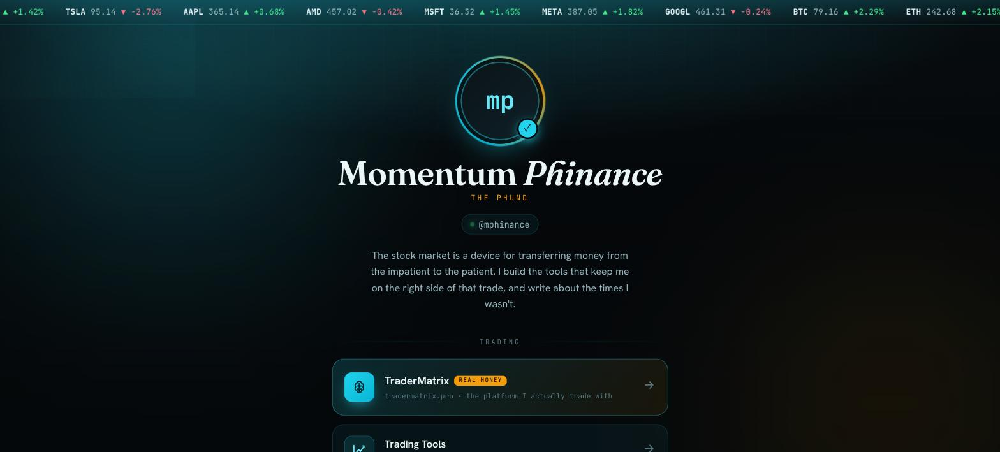
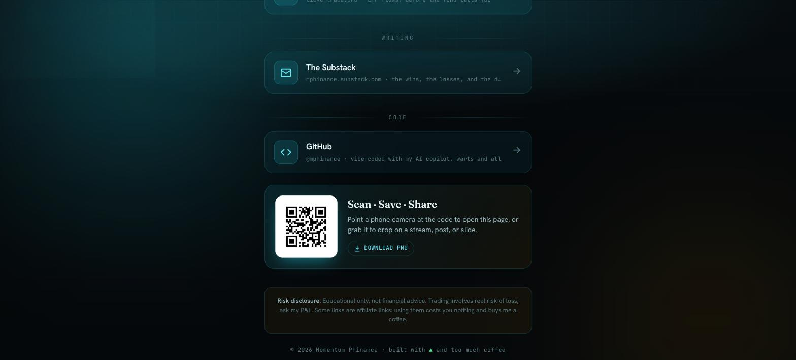

# Link Hub

A Linktree alternative you actually own. One static `index.html`, no build step,
no signup, no monthly fee, no tracking pixels you didn't ask for. Free hosting
on GitHub Pages, your own domain if you want one.

This repo is the live example: [mphinance.com](https://mphinance.com). Fork it,
swap the config, ship your own version tonight.

<p>
  
  
</p>

## Why this over Linktree

- You own the code and the data. Nobody can rebrand it, rate-limit it, or put
  their logo on your page.
- It's just HTML/CSS/JS. No account, no app, no platform to log into.
- Free forever on GitHub Pages. Bring your own domain for a few dollars a year
  if you want, or use the free `you.github.io/repo-name` URL.
- Looks like a real product, not a template everyone recognizes on sight.

## Make your own

1. **Fork this repo** (or use it as a template) and rename it.
2. **Open `config.js`.** That's the only file you touch. Set your name, tagline,
   bio, and monogram, then list your links in `sections`. Copy an existing
   `{ ... }` block, change `title` / `sub` / `url`, pick an `icon` from the list
   at the bottom of the file.
3. **Pick your colors.** The CSS custom properties at the top of `index.html`
   (`:root { --bg, --cyan, --amber, ... }`) control the whole palette. Change a
   handful of hex values and the glow, ticker tape, and link cards all follow.
4. **Push to `main`.** GitHub Pages auto-publishes in about a minute. Turn it
   on under **Settings → Pages** if it isn't already (source: `main`, path `/`).
5. **Optional: custom domain.** Add a `CNAME` file with your domain in it, then
   point DNS at GitHub's edge:

   | Type | Host | Value |
   |---|---|---|
   | A | `@` | `185.199.108.153` |
   | A | `@` | `185.199.109.153` |
   | A | `@` | `185.199.110.153` |
   | A | `@` | `185.199.111.153` |
   | CNAME | `www` | `<you>.github.io` |

That's the whole build. No frameworks, no npm install, no dashboard.

## The QR code


Scans straight to [mphinance.com](https://mphinance.com). Every page built from
this template has one, generated straight from the live URL and dropped in
`assets/qr.png`.

Regenerate yours after forking (or any time the URL changes):

```bash
pip install qrcode pillow
python -c "import qrcode; qrcode.make('https://your-domain/').save('assets/qr.png')"
```

---
Educational content only, not financial advice.
